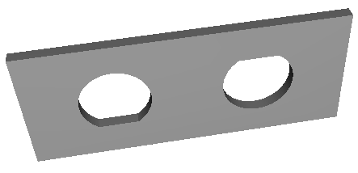

# Panel fuse holder alignment plate for a PowerDataTec socket strip

https://www.powerdatatec.com/p-pack-desktops

I have one of these "P Pack 4/2S" desktop power strips with ethernet sockets,
second hand eBay purchase, which lasted a while but then failed.
On investigation the fuse holders were twisting around and damaging the soldered connections.

This seems to be a design flaw. The fuse holders do have a moulded flat on one side
to engage in a suitably punched panel hole, but the manufacturer just used circular holes.

There's a bit of space behind the panel to add in a shim with flats to match the fuseholder body.

I started with a basic AI prompt (ChatGPT, I think) something like this

> This a 2mm thick rectangular plate 54x22mm in size.
> There are two holes cut in in normal to the largest faces, with their centres aligned on the long centre axis,
> 24mm apart and symmetrical around the short centre axis. the holes are 12mm circles but with a flat of 1mm on one side.
> The flat sides are aligned with the long axis, one on each side of that axis

It did a terrible job initially, but gave me some ideas.
