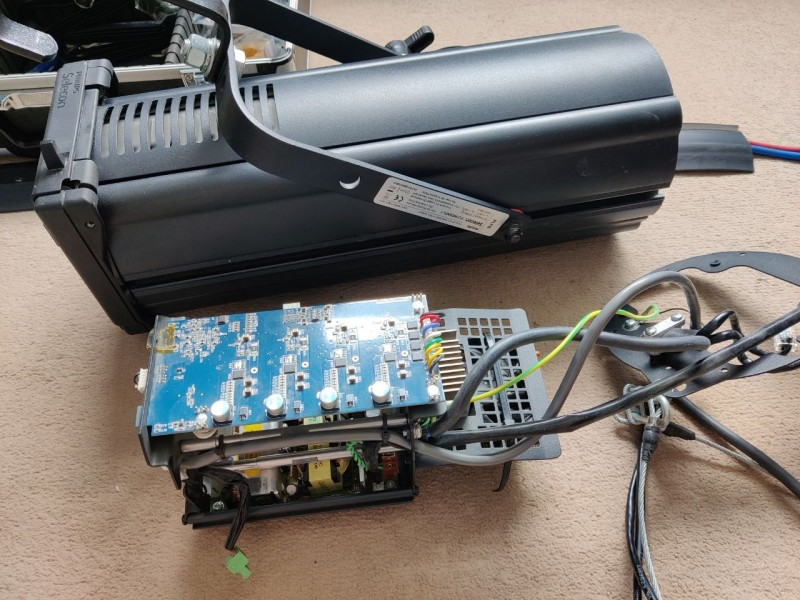
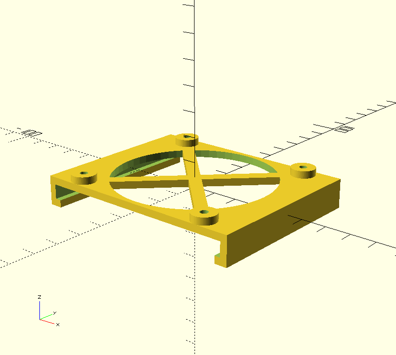

# Selecon heatsink clip

This design is for a replacement fan/heatsink clip, for a Selecon PLFRESNEL1 stage lighting fixture.

While investigating a total power-on-failure of one of these, I found the fan practically falling
off the heatsink. The securing screws had pulled through the plastic of the clip.

SCAD file partly generated using Gemini. NB *this output has not yet been tested even for basic geometry fit*

## Recommendations

This will need a fairly high-temperature FDM material like PA6 (Nylon), as the operating
temperature of the light is liable to exceed 125 C.  Polycarbonate could also be an option.
Prototypes for geometry checks can of couse be PLA.

It also needs to be soft enough to take self-tapping screws typical of fan mounts. M3 are
used in the original and can be reused, although replacing with bolts and tapped heat-set
inserts would also be an option (not accounted for in this design).
